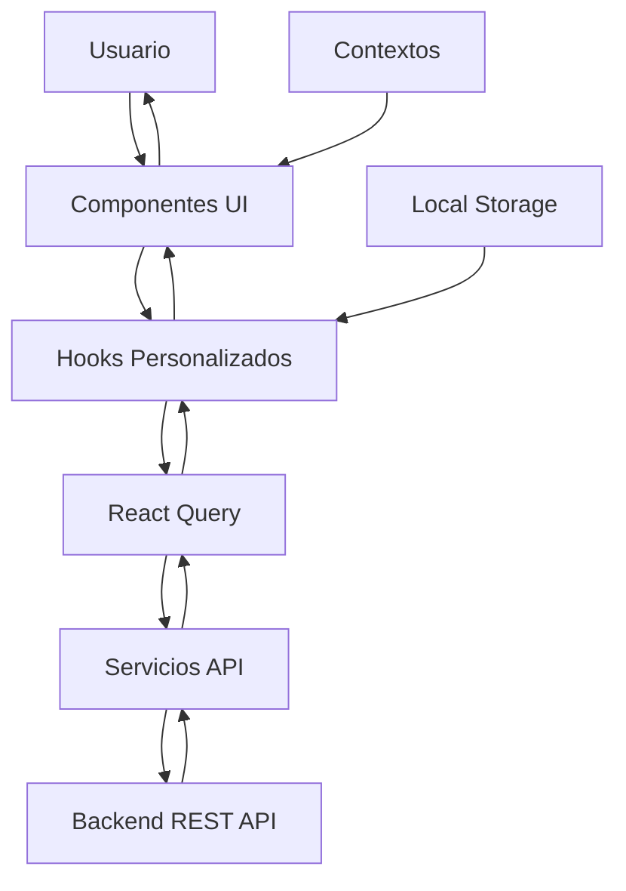

# VitalCare Frontend 🏥

> **Sistema de Gestión de Citas Médicas** - Una aplicación web moderna y accesible para la gestión integral de citas médicas, construida con React, TypeScript y Tailwind CSS.

[](https://reactjs.org/)
[](https://www.typescriptlang.org/)
[](https://vitejs.dev/)
[](https://tailwindcss.com/)
[](https://tanstack.com/query/latest)

## 📋 Tabla de Contenidos

- [🌟 Características](#-características)
- [🏗️ Arquitectura](#️-arquitectura)
- [🛠️ Tecnologías](#️-tecnologías)
- [📁 Estructura del Proyecto](#-estructura-del-proyecto)
- [🚀 Instalación y Configuración](#-instalación-y-configuración)
- [🏃‍♂️ Ejecución del Proyecto](#️-ejecución-del-proyecto)
- [📱 Funcionalidades](#-funcionalidades)
- [🎨 Sistema de Diseño](#-sistema-de-diseño)
- [🔧 Scripts Disponibles](#-scripts-disponibles)
- [🌐 Variables de Entorno](#-variables-de-entorno)
- [📦 Build y Despliegue](#-build-y-despliegue)
- [🧪 Testing](#-testing)
- [🤝 Contribución](#-contribución)
- [📄 Licencia](#-licencia)
- [👥 Autores](#-autores)
- [🙏 Agradecimientos](#-agradecimientos)

## 🌟 Características

### ✨ Funcionalidades Principales

- **👤 Gestión de Usuarios**: Sistema completo de autenticación y autorización
- **📅 Gestión de Citas**: Creación, modificación y cancelación de citas médicas
- **🏥 Múltiples Roles**: Pacientes, Doctores y Personal Administrativo
- **📱 Diseño Responsive**: Optimizado para desktop, tablet y móvil
- **♿ Accesibilidad**: Cumple con estándares WCAG 2.1
- **🌙 Modo Oscuro**: Soporte completo para tema claro y oscuro
- **🔔 Notificaciones**: Sistema de toast para feedback en tiempo real
- **🔄 Estado Global**: Gestión eficiente del estado con React Query
- **🚀 Performance**: Optimizado con Vite y lazy loading

### 🎯 Características Técnicas

- **TypeScript**: Tipado fuerte para mayor robustez
- **Componentes Reutilizables**: Biblioteca de componentes UI consistente
- **Hooks Personalizados**: Lógica reutilizable y testable
- **Validación en Tiempo Real**: Feedback inmediato en formularios
- **Manejo de Errores**: Sistema robusto de manejo de errores
- **SEO Friendly**: Optimizado para motores de búsqueda
- **PWA Ready**: Preparado para Progressive Web App

## 🏗️ Arquitectura

### 📊 Arquitectura General

```
VitalCare Frontend/
├── 📁 public/              # Archivos estáticos
├── 📁 src/
│   ├── 📁 components/      # Componentes reutilizables
│   │   ├── 📁 ui/         # Componentes base (Button, Input, etc.)
│   │   ├── 📁 layout/     # Layouts y navegación
│   │   ├── 📁 pages/      # Páginas principales
│   │   └── 📁 contexts/   # Contextos de React
│   ├── 📁 hooks/          # Hooks personalizados
│   ├── 📁 services/       # Servicios de API
│   ├── 📁 types/          # Definiciones TypeScript
│   ├── 📁 utils/          # Utilidades
│   ├── 📄 App.tsx         # Componente principal
│   └── 📄 main.tsx        # Punto de entrada
├── 📄 package.json        # Dependencias y scripts
├── 📄 tsconfig.json       # Configuración TypeScript
├── 📄 vite.config.ts      # Configuración Vite
└── 📄 tailwind.config.js  # Configuración Tailwind
```

### 🔄 Flujo de Datos



## 🛠️ Tecnologías

### Core Framework
- **[React 19.1.1](https://reactjs.org/)** - Framework principal
- **[TypeScript 5.9.2](https://www.typescriptlang.org/)** - Tipado fuerte
- **[Vite 7.1.4](https://vitejs.dev/)** - Build tool y dev server

### UI & Styling
- **[Tailwind CSS 4.1.13](https://tailwindcss.com/)** - Framework CSS utilitario
- **[Lucide React](https://lucide.dev/)** - Iconos SVG
- **[clsx](https://github.com/lukeed/clsx)** - Utilidad para clases condicionales
- **[tailwind-merge](https://github.com/dcastil/tailwind-merge)** - Merge de clases Tailwind

### State Management
- **[React Query 5.87.1](https://tanstack.com/query/latest)** - Gestión de estado del servidor
- **[React Router DOM 7.8.2](https://reactrouter.com/)** - Routing y navegación

### Development Tools
- **[@vitejs/plugin-react](https://github.com/vitejs/vite-plugin-react)** - Plugin React para Vite
- **[@tailwindcss/vite](https://tailwindcss.com/docs/vite-plugin)** - Plugin Tailwind para Vite
- **[ESLint](https://eslint.org/)** - Linting y calidad de código

## 📁 Estructura del Proyecto

### 📂 `src/components/`
```
components/
├── 📁 ui/                    # Componentes base reutilizables
│   ├── Button.tsx           # Botón configurable
│   ├── Card.tsx             # Tarjeta contenedora
│   ├── Input.tsx            # Campo de entrada
│   ├── Toast.tsx            # Notificación individual
│   └── ToastContainer.tsx   # Contenedor de notificaciones
├── 📁 layout/               # Layouts y navegación
│   ├── MainLayout.tsx       # Layout principal con sidebar
│   └── Sidebar.tsx          # Barra lateral de navegación
├── 📁 pages/                # Páginas principales
│   ├── 📁 auth/            # Páginas de autenticación
│   │   ├── LoginPage.tsx   # Página de inicio de sesión
│   │   └── RegisterPage.tsx # Página de registro
│   ├── 📁 appointments/    # Páginas de citas
│   │   ├── AppointmentsPage.tsx      # Lista de citas
│   │   └── CreateAppointmentPage.tsx # Crear nueva cita
│   └── 📁 dashboard/       # Dashboard principal
│       └── DashboardPage.tsx # Página principal del dashboard
├── 📁 accessibility/       # Componentes de accesibilidad
│   └── AccessibilityMenu.tsx # Menú de opciones de accesibilidad
└── 📁 appointments/        # Componentes específicos de citas
    └── CreateAppointmentModal.tsx # Modal para crear citas
```

### 📂 `src/hooks/`
```
hooks/
├── useAuth.ts              # Hook para autenticación
├── useAppointments.ts      # Hook para gestión de citas
└── useEnvironmentInfo.ts   # Hook para información del entorno
```

### 📂 `src/services/`
```
services/
├── api.ts                  # Cliente HTTP principal
├── auth.ts                 # Servicios de autenticación
├── appointments.ts         # Servicios de citas médicas
└── cities.ts               # Servicios de ciudades
```

### 📂 `src/contexts/`
```
contexts/
├── AccessibilityContext.tsx # Contexto de accesibilidad
└── ToastContext.tsx        # Contexto de notificaciones
```

### 📂 `src/types/`
```
types/
├── api.ts                  # Tipos de API y DTOs
└── index.ts               # Tipos generales
```

### 📂 `src/utils/`
```
utils/
├── cn.ts                   # Utilidad para combinar clases CSS
└── helpers.ts             # Funciones helper generales
```

## 🚀 Instalación y Configuración

### 📋 Prerrequisitos

- **Node.js** >= 18.0.0
- **npm** >= 8.0.0 o **yarn** >= 1.22.0
- **Git** para control de versiones

### 🔧 Instalación

1. **Clonar el repositorio**
   ```bash
   git clone https://github.com/JuanNorena/VitalCare.git
   cd VitalCare/VitalCare_front
   ```

2. **Instalar dependencias**
   ```bash
   npm install
   # o
   yarn install
   ```

3. **Configurar variables de entorno**
   ```bash
   cp .env.development .env.local
   ```

4. **Editar variables de entorno** (`.env.local`)
   ```bash
   VITE_API_BASE_URL=https://vitalcare-back.onrender.com
   VITE_ENVIRONMENT=development
   ```

## 🏃‍♂️ Ejecución del Proyecto

### 🚀 Modo Desarrollo

```bash
npm run dev
# o
yarn dev
```

La aplicación estará disponible en: `http://localhost:5173`

### 🏗️ Build de Producción

```bash
npm run build
# o
yarn build
```

### 👀 Vista Previa del Build

```bash
npm run preview
# o
yarn preview
```

## 📱 Funcionalidades

### 👤 Sistema de Autenticación

- **Inicio de Sesión**: Autenticación segura con JWT
- **Registro de Usuarios**: Creación de cuentas nuevas
- **Recuperación de Contraseña**: Sistema de recuperación por email
- **Cierre de Sesión**: Logout seguro con limpieza de estado

### 📅 Gestión de Citas

- **Ver Citas**: Lista completa de citas por rol
- **Crear Cita**: Formulario inteligente con validaciones
- **Editar Cita**: Modificación de citas existentes
- **Cancelar Cita**: Cancelación con confirmación
- **Confirmar Asistencia**: Marcado de citas completadas

### 🎛️ Panel de Control

- **Dashboard Personalizado**: Vista adaptada por rol
- **Estadísticas**: Métricas relevantes por usuario
- **Navegación Intuitiva**: Sidebar responsive
- **Notificaciones**: Sistema de alertas en tiempo real

### ♿ Accesibilidad

- **Navegación por Teclado**: Soporte completo para navegación
- **Lector de Pantalla**: Compatible con screen readers
- **Contraste Alto**: Cumple estándares de accesibilidad
- **Escalado de Fuente**: Ajuste dinámico del tamaño de texto
- **Modo de Alto Contraste**: Opción para mejor visibilidad

## 🎨 Sistema de Diseño

### 🎨 Paleta de Colores

```css
/* Tema Claro (por defecto) */
--vc-bg: #ffffff;           /* Fondo principal */
--vc-text: #1f2937;         /* Texto principal */
--vc-primary: #3b82f6;      /* Azul primario */
--vc-secondary: #64748b;    /* Gris secundario */
--vc-success: #10b981;      /* Verde éxito */
--vc-warning: #f59e0b;      /* Amarillo advertencia */
--vc-error: #ef4444;        /* Rojo error */

/* Tema Oscuro */
--vc-bg: #0f172a;           /* Fondo oscuro */
--vc-text: #f1f5f9;         /* Texto claro */
--vc-card-bg: #1e293b;      /* Fondo de tarjetas */
```

### 📐 Sistema de Espaciado

```css
/* Escala de espaciado (rem) */
--vc-space-1: 0.25rem;   /* 4px */
--vc-space-2: 0.5rem;    /* 8px */
--vc-space-3: 0.75rem;   /* 12px */
--vc-space-4: 1rem;      /* 16px */
--vc-space-6: 1.5rem;    /* 24px */
--vc-space-8: 2rem;      /* 32px */
--vc-space-12: 3rem;     /* 48px */
--vc-space-16: 4rem;     /* 64px */
```

### 🔤 Tipografía

```css
/* Fuentes principales */
--vc-font-family: 'Inter', system-ui, sans-serif;
--vc-font-mono: 'JetBrains Mono', monospace;

/* Escala tipográfica */
--vc-font-xs: 0.75rem;    /* 12px */
--vc-font-sm: 0.875rem;   /* 14px */
--vc-font-base: 1rem;     /* 16px */
--vc-font-lg: 1.125rem;   /* 18px */
--vc-font-xl: 1.25rem;    /* 20px */
--vc-font-2xl: 1.5rem;    /* 24px */
--vc-font-3xl: 1.875rem;  /* 30px */
```

## 🔧 Scripts Disponibles

```json
{
  "scripts": {
    "dev": "vite --mode development",
    "build": "tsc && vite build --mode production",
    "build:dev": "tsc && vite build --mode development",
    "preview": "vite preview",
    "preview:dev": "vite preview --mode development"
  }
}
```

### 📝 Descripción de Scripts

- **`npm run dev`**: Inicia el servidor de desarrollo con hot reload
- **`npm run build`**: Construye la aplicación para producción
- **`npm run build:dev`**: Construye la aplicación en modo desarrollo
- **`npm run preview`**: Vista previa del build de producción
- **`npm run preview:dev`**: Vista previa del build de desarrollo

## 🌐 Variables de Entorno

### 📄 `.env.development`

```bash
# Configuración para desarrollo local
VITE_API_BASE_URL=https://vitalcare-back.onrender.com
VITE_ENVIRONMENT=development
```

### 📄 `.env.production`

```bash
# Configuración para producción
VITE_API_BASE_URL=https://vitalcare-back.onrender.com
VITE_ENVIRONMENT=production
```

### 🔍 Variables Disponibles

| Variable | Descripción | Valor por Defecto |
|----------|-------------|-------------------|
| `VITE_API_BASE_URL` | URL base de la API backend | `https://vitalcare-back.onrender.com` |
| `VITE_ENVIRONMENT` | Entorno de ejecución | `development` |

## 📦 Build y Despliegue

### 🏗️ Proceso de Build

1. **Verificar dependencias**
   ```bash
   npm ci
   ```

2. **Ejecutar tests** (si existen)
   ```bash
   npm test
   ```

3. **Build de producción**
   ```bash
   npm run build
   ```

4. **Verificar build**
   ```bash
   npm run preview
   ```

### 🚀 Despliegue

La aplicación está configurada para desplegarse en:

- **Vercel**: Configuración automática con `vercel.json`
- **Netlify**: Detección automática de Vite
- **GitHub Pages**: Con GitHub Actions
- **Servidor tradicional**: Copiando carpeta `dist/`

### 📊 Optimizaciones de Build

- **Code Splitting**: División automática de código
- **Tree Shaking**: Eliminación de código no utilizado
- **Minificación**: Compresión de JavaScript y CSS
- **Asset Optimization**: Optimización de imágenes y fuentes
- **Caching**: Headers de cache apropiados

## 🧪 Testing

### 📋 Estrategia de Testing

```typescript
// Ejemplo de estructura de tests
describe('CreateAppointmentPage', () => {
  it('should validate form fields', () => {
    // Test de validación
  });

  it('should submit appointment successfully', () => {
    // Test de envío exitoso
  });

  it('should handle API errors gracefully', () => {
    // Test de manejo de errores
  });
});
```

### 🛠️ Herramientas de Testing Recomendadas

- **[Vitest](https://vitest.dev/)** - Framework de testing para Vite
- **[React Testing Library](https://testing-library.com/docs/react-testing-library/intro/)** - Testing de componentes React
- **[MSW](https://mswjs.io/)** - Mock de API para testing
- **[Playwright](https://playwright.dev/)** - Testing end-to-end

## 🤝 Contribución

### 📋 Guías de Contribución

1. **Fork** el proyecto
2. **Crear** una rama para tu feature (`git checkout -b feature/AmazingFeature`)
3. **Commit** tus cambios (`git commit -m 'Add some AmazingFeature'`)
4. **Push** a la rama (`git push origin feature/AmazingFeature`)
5. **Abrir** un Pull Request

### 📏 Estándares de Código

- **TypeScript**: Usar tipos explícitos
- **ESLint**: Seguir reglas de linting
- **Prettier**: Formateo automático de código
- **Conventional Commits**: Commits semánticos

### 🔍 Code Review

- ✅ **Funcionalidad**: ¿Funciona como se espera?
- ✅ **Performance**: ¿Es eficiente?
- ✅ **Accesibilidad**: ¿Cumple estándares WCAG?
- ✅ **Responsive**: ¿Funciona en todos los dispositivos?
- ✅ **Testing**: ¿Tiene cobertura adecuada?

## 📄 Licencia

Este proyecto está bajo la Licencia MIT - ver el archivo [LICENSE](../LICENSE) para más detalles.

## 👥 Autores

- **Juan Norena** - *Desarrollador Principal* - [GitHub](https://github.com/JuanNorena)
- **Equipo VitalCare** - *Contribuidores* - [Ver contribuidores](../../graphs/contributors)

## 🙏 Agradecimientos

- **React Team** por el increíble framework
- **Tailwind CSS** por el sistema de diseño utilitario
- **TanStack** por React Query
- **Comunidad Open Source** por las herramientas y bibliotecas

---

<div align="center">

**VitalCare** - Gestionando citas médicas con excelencia 💙

[](https://github.com/JuanNorena/VitalCare/stargazers)
[](https://github.com/JuanNorena/VitalCare/network/members)

*Hecho con ❤️ para mejorar la atención médica*

</div></content>
<parameter name="filePath">c:\Universidad\Octavo Semestre\Software_3\VitalCare_front\README.md
