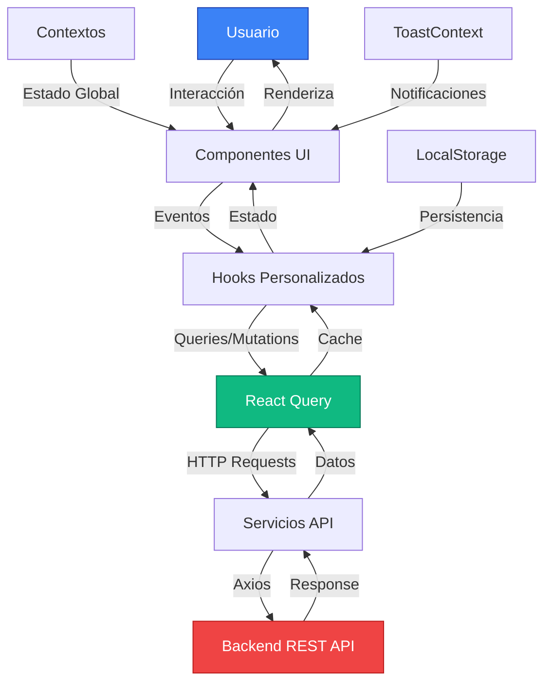

# VitalCare Frontend 🏥

> **Sistema de Gestión de Citas Médicas** - Una aplicación web moderna y accesible para la gestión integral de citas médicas, construida con React, TypeScript y Tailwind CSS.

[](https://reactjs.org/)
[](https://www.typescriptlang.org/)
[](https://vitejs.dev/)
[](https://tailwindcss.com/)
[](https://tanstack.com/query/latest)

## 📋 Tabla de Contenidos

- [🌟 Características](#-características)
- [🏗️ Arquitectura](#️-arquitectura)
- [🛠️ Tecnologías](#️-tecnologías)
- [📁 Estructura del Proyecto](#-estructura-del-proyecto)
- [🚀 Instalación y Configuración](#-instalación-y-configuración)
- [🏃‍♂️ Ejecución del Proyecto](#️-ejecución-del-proyecto)
- [📱 Funcionalidades](#-funcionalidades)
- [🎨 Sistema de Diseño](#-sistema-de-diseño)
- [🔧 Scripts Disponibles](#-scripts-disponibles)
- [🌐 Variables de Entorno](#-variables-de-entorno)
- [📦 Build y Despliegue](#-build-y-despliegue)
- [🧪 Testing](#-testing)
- [🤝 Contribución](#-contribución)
- [📄 Licencia](#-licencia)
- [👥 Autores](#-autores)
- [🙏 Agradecimientos](#-agradecimientos)

## 🌟 Características

### ✨ Funcionalidades Principales

- **👤 Gestión de Usuarios**: Sistema completo de autenticación y autorización
- **📅 Gestión de Citas**: Creación, modificación y cancelación de citas médicas
- **🏥 Múltiples Roles**: Pacientes, Doctores y Personal Administrativo
- **📱 Diseño Responsive**: Optimizado para desktop, tablet y móvil
- **♿ Accesibilidad**: Cumple con estándares WCAG 2.1
- **🌙 Modo Oscuro**: Soporte completo para tema claro y oscuro
- **🔔 Notificaciones**: Sistema de toast para feedback en tiempo real
- **🔄 Estado Global**: Gestión eficiente del estado con React Query
- **🚀 Performance**: Optimizado con Vite y lazy loading

### 🎯 Características Técnicas

- **TypeScript**: Tipado fuerte para mayor robustez
- **Componentes Reutilizables**: Biblioteca de componentes UI consistente
- **Hooks Personalizados**: Lógica reutilizable y testable
- **Validación en Tiempo Real**: Feedback inmediato en formularios
- **Manejo de Errores**: Sistema robusto de manejo de errores
- **SEO Friendly**: Optimizado para motores de búsqueda
- **PWA Ready**: Preparado para Progressive Web App

## 🏗️ Arquitectura

### 📊 Arquitectura General

```
VitalCare Frontend/
├── 📁 public/              # Archivos estáticos
│   └── vite.svg           # Logo de Vite
├── 📁 src/
│   ├── � main.tsx        # Punto de entrada (React Query + Router)
│   ├── 📄 App.tsx         # Componente raíz con contextos
│   ├── 📄 routes.tsx      # Configuración de rutas centralizadas
│   ├── 📄 index.css       # Estilos globales + Tailwind
│   │
│   ├── �📁 components/     # Componentes reutilizables
│   │   ├── 📁 ui/        # Componentes base (Button, Input, Card)
│   │   ├── 📁 layout/    # Layouts (MainLayout, Sidebar)
│   │   ├── 📁 appointments/ # Componentes de citas
│   │   ├── 📁 clinical/  # Componentes clínicos (doctores)
│   │   ├── 📁 accessibility/ # Accesibilidad
│   │   ├── 📁 navigation/    # Navegación
│   │   └── 📁 legal/         # Componentes legales
│   │
│   ├── 📁 pages/          # Páginas principales
│   │   ├── 📁 auth/      # Autenticación (Login, Register, etc.)
│   │   ├── 📁 appointments/ # Gestión de citas
│   │   ├── 📁 dashboard/    # Dashboard principal
│   │   └── 📁 doctor/       # Módulo exclusivo doctores
│   │
│   ├── 📁 hooks/          # Hooks personalizados
│   │   ├── useAuth.ts        # Hook de autenticación
│   │   ├── useAppointments.ts # Hook de citas
│   │   └── useDoctorProfile.ts # Hook perfil doctor
│   │
│   ├── 📁 services/       # Servicios de API (Axios)
│   │   ├── api.ts            # Cliente HTTP base
│   │   ├── auth.ts           # Servicios de auth
│   │   ├── appointments.ts   # Servicios de citas
│   │   ├── consultations.ts  # Servicios de consultas
│   │   ├── doctors.ts        # Servicios de doctores
│   │   ├── cities.ts         # Servicios de ciudades
│   │   ├── passwordReset.ts  # Recuperación de contraseña
│   │   └── userProfile.ts    # Perfil de usuario
│   │
│   ├── 📁 contexts/       # Contextos de React
│   │   ├── AccessibilityContext.tsx # Estado de accesibilidad
│   │   └── ToastContext.tsx        # Sistema de notificaciones
│   │
│   ├── 📁 types/          # Definiciones TypeScript
│   │   ├── api.ts            # Tipos de API y DTOs
│   │   └── clinical.ts       # Tipos de datos clínicos
│   │
│   └── 📁 utils/          # Utilidades
│       └── cn.ts             # Utilidad para clases CSS
│
├── � tests/              # Tests unitarios
│   ├── setup.ts           # Configuración global de tests
│   ├── 📁 helpers/        # Utilidades de testing
│   ├── � mocks/          # Datos mock
│   └── 📁 unit/           # Tests unitarios organizados
│
├── 📄 package.json        # Dependencias y scripts
├── 📄 tsconfig.json       # Configuración TypeScript
├── 📄 vite.config.ts      # Configuración Vite
├── 📄 vitest.config.ts    # Configuración Vitest
├── 📄 tailwind.config.js  # Configuración Tailwind
├── 📄 .env.development    # Variables de entorno (dev)
├── 📄 .env.production     # Variables de entorno (prod)
└── 📄 .eslintrc.json      # Configuración ESLint
```

---

### 🔄 Flujo de Datos



**Explicación del Flujo:**

1. **Usuario → Componentes UI**: Interacción (clicks, inputs)
2. **Componentes → Hooks**: Lógica de negocio separada
3. **Hooks → React Query**: Gestión de estado del servidor
4. **React Query → Servicios**: Peticiones HTTP estructuradas
5. **Servicios → Backend**: Comunicación REST con Axios
6. **Backend → Usuario**: Respuesta completa con actualización UI

---

### 🛣️ Sistema de Rutas

#### **Arquitectura de Routing**

El proyecto usa **React Router v7** con un sistema de rutas centralizado:

```typescript
// src/routes.tsx - Estructura principal
export function AppRoutes() {
  return (
    <Routes>
      {/* Rutas Públicas */}
      <Route path="/login" element={<PublicRoute><LoginPage /></PublicRoute>} />
      <Route path="/register" element={<PublicRoute><RegisterPage /></PublicRoute>} />
      
      {/* Rutas Protegidas */}
      <Route path="/dashboard" element={
        <ProtectedRoute>
          <MainLayout><DashboardPage /></MainLayout>
        </ProtectedRoute>
      } />
      
      {/* ... más rutas */}
    </Routes>
  );
}
```

#### **Mapa Completo de Rutas**

| Ruta | Tipo | Componente | Requiere Auth | Rol |
|------|------|------------|---------------|-----|
| `/` | Redirect | → `/login` | ❌ No | Todos |
| `/login` | Pública | `LoginPage` | ❌ No | Sin auth |
| `/register` | Pública | `RegisterPage` | ❌ No | Sin auth |
| `/auth/forgot-password` | Pública | `ForgotPasswordPage` | ❌ No | Sin auth |
| `/auth/verify-reset-code` | Pública | `VerifyResetCodePage` | ❌ No | Sin auth |
| `/auth/reset-password` | Pública | `ResetPasswordPage` | ❌ No | Sin auth |
| `/dashboard` | Protegida | `DashboardPage` | ✅ Sí | Todos |
| `/profile` | Protegida | `ProfilePage` | ✅ Sí | Todos |
| `/appointments` | Protegida | `AppointmentsPage` | ✅ Sí | Paciente/Doctor |
| `/create-appointment` | Protegida | `CreateAppointmentPage` | ✅ Sí | Paciente |
| `/doctor/appointments` | Protegida | `DoctorAppointmentsPage` | ✅ Sí | Doctor |
| `/doctor/consultation/:id` | Protegida | `ConsultationPage` | ✅ Sí | Doctor |
| `*` (404) | Redirect | → `/login` | ❌ No | Todos |

#### **Guardias de Ruta**

**ProtectedRoute**: Protege rutas que requieren autenticación

```typescript
function ProtectedRoute({ children }: { children: React.ReactNode }) {
  const { isAuthenticated, isLoading } = useAuth();

  // Muestra loading mientras verifica autenticación
  if (isLoading) {
    return <LoadingSpinner />;
  }

  // Redirige a login si no autenticado
  return isAuthenticated ? <>{children}</> : <Navigate to="/login" replace />;
}
```

**PublicRoute**: Protege rutas solo para usuarios NO autenticados

```typescript
function PublicRoute({ children }: { children: React.ReactNode }) {
  const { isAuthenticated, isLoading } = useAuth();

  if (isLoading) {
    return <LoadingSpinner />;
  }

  // Si ya autenticado, redirige a dashboard
  return isAuthenticated ? <Navigate to="/dashboard" replace /> : <>{children}</>;
}
```

#### **Navegación Programática**

```typescript
import { useNavigate } from 'react-router-dom';

function MyComponent() {
  const navigate = useNavigate();

  const handleSuccess = () => {
    // Navegar con reemplazo de historial
    navigate('/dashboard', { replace: true });
    
    // Navegar con estado
    navigate('/appointments', { 
      state: { appointmentId: '123' } 
    });
    
    // Navegar atrás
    navigate(-1);
  };
}
```

---

### 🧩 Arquitectura de Componentes

#### **Jerarquía de Componentes**

```
App (Raíz)
├── ToastProvider (Contexto de notificaciones)
├── AccessibilityProvider (Contexto de accesibilidad)
└── Router
    └── AppRoutes
        ├── PublicRoute (Rutas públicas)
        │   ├── LoginPage
        │   ├── RegisterPage
        │   └── ForgotPasswordPage
        │
        └── ProtectedRoute (Rutas protegidas)
            └── MainLayout (Sidebar + Contenido)
                ├── Sidebar (Navegación)
                ├── AccessibilityMenu (Opciones)
                └── Page Content
                    ├── DashboardPage
                    ├── AppointmentsPage
                    ├── CreateAppointmentPage
                    └── ProfilePage
```

#### **Composición de Componentes**

**Ejemplo: Card Component (Compound Component Pattern)**

```typescript
// Uso composición para máxima flexibilidad
<Card>
  <CardHeader>
    <CardTitle>Próxima Cita</CardTitle>
    <CardDescription>Dr. Juan Pérez - Medicina General</CardDescription>
  </CardHeader>
  <CardContent>
    <p>Fecha: 25/10/2025</p>
    <p>Hora: 10:00 AM</p>
  </CardContent>
  <CardFooter>
    <Button variant="outline">Cancelar</Button>
    <Button>Ver detalles</Button>
  </CardFooter>
</Card>
```

#### **Patrón de Hooks Personalizados**

```typescript
// Hook que encapsula lógica compleja
export function useAppointments() {
  const queryClient = useQueryClient();

  // Query para obtener citas
  const { data: appointments, isLoading } = useQuery({
    queryKey: ['appointments'],
    queryFn: appointmentsService.getAll,
  });

  // Mutation para crear cita
  const createMutation = useMutation({
    mutationFn: appointmentsService.create,
    onSuccess: () => {
      queryClient.invalidateQueries({ queryKey: ['appointments'] });
      showToast({ type: 'success', message: 'Cita creada' });
    },
  });

  return {
    appointments,
    isLoading,
    createAppointment: createMutation.mutate,
  };
}
```

---

### 🔌 Integración con Backend

#### **Cliente HTTP Base**

```typescript
// src/services/api.ts
import axios from 'axios';

const api = axios.create({
  baseURL: import.meta.env.VITE_API_BASE_URL,
  headers: {
    'Content-Type': 'application/json',
  },
});

// Interceptor para agregar token JWT
api.interceptors.request.use((config) => {
  const token = localStorage.getItem('accessToken');
  if (token) {
    config.headers.Authorization = `Bearer ${token}`;
  }
  return config;
});

// Interceptor para manejar errores
api.interceptors.response.use(
  (response) => response,
  async (error) => {
    if (error.response?.status === 401) {
      // Token expirado, intentar refresh
      await refreshToken();
    }
    return Promise.reject(error);
  }
);
```

#### **Estructura de Servicios**

```typescript
// src/services/appointments.ts
export const appointmentsService = {
  // GET /api/appointments
  getAll: async (): Promise<Appointment[]> => {
    const { data } = await api.get('/appointments');
    return data;
  },

  // POST /api/appointments
  create: async (appointment: CreateAppointmentDto): Promise<Appointment> => {
    const { data } = await api.post('/appointments', appointment);
    return data;
  },

  // PUT /api/appointments/:id
  update: async (id: string, appointment: UpdateAppointmentDto): Promise<Appointment> => {
    const { data } = await api.put(`/appointments/${id}`, appointment);
    return data;
  },

  // DELETE /api/appointments/:id
  cancel: async (id: string): Promise<void> => {
    await api.delete(`/appointments/${id}`);
  },
};
```

#### **Endpoints del Backend**

| Método | Endpoint | Descripción | Requiere Auth |
|--------|----------|-------------|---------------|
| `POST` | `/api/auth/login` | Inicio de sesión | ❌ |
| `POST` | `/api/auth/register` | Registro de usuario | ❌ |
| `POST` | `/api/auth/refresh` | Renovar token | ✅ |
| `POST` | `/api/auth/logout` | Cerrar sesión | ✅ |
| `GET` | `/api/appointments` | Obtener citas | ✅ |
| `POST` | `/api/appointments` | Crear cita | ✅ |
| `PUT` | `/api/appointments/:id` | Actualizar cita | ✅ |
| `DELETE` | `/api/appointments/:id` | Cancelar cita | ✅ |
| `GET` | `/api/doctors` | Listar doctores | ✅ |
| `GET` | `/api/doctors/:id` | Obtener doctor | ✅ |
| `POST` | `/api/consultations` | Crear consulta | ✅ (Doctor) |
| `GET` | `/api/consultations/:id` | Obtener consulta | ✅ |
| `GET` | `/api/cities` | Listar ciudades | ❌ |
| `POST` | `/api/password-reset/request` | Solicitar reset | ❌ |
| `POST` | `/api/password-reset/verify` | Verificar código | ❌ |
| `POST` | `/api/password-reset/reset` | Cambiar contraseña | ❌ |

---

### 🎨 Sistema de Diseño y Componentes UI

#### **Componentes Base (Design System)**

| Componente | Props Principales | Variantes | Uso |
|------------|-------------------|-----------|-----|
| `Button` | `variant`, `size`, `disabled` | default, destructive, outline, secondary, ghost, link | Acciones y navegación |
| `Input` | `type`, `placeholder`, `error` | text, email, password, number, date | Entrada de datos |
| `Card` | `className` | - | Contenedores de información |
| `DatePicker` | `value`, `onChange`, `minDate` | - | Selección de fechas |
| `Toast` | `type`, `title`, `message` | success, error, warning, info | Notificaciones |

#### **Sistema de Variables CSS**

```css
/* src/index.css */
:root {
  /* Colores principales */
  --vc-primary: #3b82f6;
  --vc-primary-hover: #2563eb;
  --vc-secondary: #64748b;
  --vc-success: #10b981;
  --vc-warning: #f59e0b;
  --vc-error: #ef4444;

  /* Backgrounds */
  --vc-bg: #ffffff;
  --vc-bg-secondary: #f8fafc;
  --vc-card-bg: #ffffff;

  /* Texto */
  --vc-text: #1f2937;
  --vc-text-secondary: #6b7280;
  --vc-text-disabled: #9ca3af;

  /* Bordes */
  --vc-border: #e5e7eb;
  --vc-border-hover: #d1d5db;

  /* Sombras */
  --vc-shadow-sm: 0 1px 2px 0 rgb(0 0 0 / 0.05);
  --vc-shadow: 0 1px 3px 0 rgb(0 0 0 / 0.1);
  --vc-shadow-lg: 0 10px 15px -3px rgb(0 0 0 / 0.1);
}

/* Tema oscuro */
[data-theme="dark"] {
  --vc-bg: #0f172a;
  --vc-bg-secondary: #1e293b;
  --vc-card-bg: #1e293b;
  --vc-text: #f1f5f9;
  --vc-text-secondary: #cbd5e1;
  --vc-border: #334155;
}
```

## 🛠️ Tecnologías

### Core Framework
- **[React 19.1.1](https://reactjs.org/)** - Framework principal
- **[TypeScript 5.9.2](https://www.typescriptlang.org/)** - Tipado fuerte
- **[Vite 7.1.4](https://vitejs.dev/)** - Build tool y dev server

### UI & Styling
- **[Tailwind CSS 4.1.13](https://tailwindcss.com/)** - Framework CSS utilitario
- **[Lucide React](https://lucide.dev/)** - Iconos SVG
- **[clsx](https://github.com/lukeed/clsx)** - Utilidad para clases condicionales
- **[tailwind-merge](https://github.com/dcastil/tailwind-merge)** - Merge de clases Tailwind

### State Management
- **[React Query 5.87.1](https://tanstack.com/query/latest)** - Gestión de estado del servidor
- **[React Router DOM 7.8.2](https://reactrouter.com/)** - Routing y navegación

### Development Tools
- **[@vitejs/plugin-react](https://github.com/vitejs/vite-plugin-react)** - Plugin React para Vite
- **[@tailwindcss/vite](https://tailwindcss.com/docs/vite-plugin)** - Plugin Tailwind para Vite
- **[ESLint](https://eslint.org/)** - Linting y calidad de código

## 📁 Estructura del Proyecto

### 📂 `src/components/`
```
components/
├── 📁 ui/                          # Componentes base reutilizables
│   ├── Button.tsx                 # Botón configurable con variantes
│   ├── Card.tsx                   # Sistema de tarjetas con composición
│   ├── Input.tsx                  # Campo de entrada con validación
│   ├── DatePicker.tsx             # Selector de fechas personalizado
│   ├── Toast.tsx                  # Notificación individual
│   └── ToastContainer.tsx         # Contenedor de notificaciones
├── 📁 layout/                     # Layouts y estructura
│   ├── MainLayout.tsx             # Layout principal con sidebar
│   └── Sidebar.tsx                # Barra lateral de navegación
├── 📁 auth/                       # Componentes de autenticación
│   └── [páginas de auth]          # Login, registro, recuperación
├── 📁 appointments/               # Componentes de citas
│   └── CancelAppointmentModal.tsx # Modal para cancelar citas
├── 📁 clinical/                   # Componentes clínicos (doctores)
│   ├── DiagnosisForm.tsx          # Formulario de diagnóstico
│   ├── SymptomsForm.tsx           # Formulario de síntomas
│   ├── TreatmentForm.tsx          # Formulario de tratamiento
│   └── VitalSignsForm.tsx         # Formulario de signos vitales
├── 📁 accessibility/              # Accesibilidad
│   └── AccessibilityMenu.tsx      # Menú de opciones de accesibilidad
├── 📁 legal/                      # Componentes legales
│   └── TermsAndConditionsModal.tsx # Modal de términos y condiciones
└── 📁 navigation/                 # Navegación
    └── Sidebar.tsx                # Barra lateral con roles
```

### 📂 `src/pages/`
```
pages/
├── 📁 auth/                       # Páginas de autenticación
│   ├── LoginPage.tsx              # Inicio de sesión
│   ├── RegisterPage.tsx           # Registro de usuarios
│   ├── ProfilePage.tsx            # Perfil de usuario
│   ├── ForgotPasswordPage.tsx     # Recuperación de contraseña
│   ├── VerifyResetCodePage.tsx    # Verificación de código
│   └── ResetPasswordPage.tsx      # Restablecer contraseña
├── 📁 appointments/               # Páginas de citas médicas
│   ├── AppointmentsPage.tsx       # Lista de citas
│   └── CreateAppointmentPage.tsx  # Crear nueva cita
├── 📁 dashboard/                  # Dashboard principal
│   └── DashboardPage.tsx          # Página principal del dashboard
└── 📁 doctor/                     # Módulo exclusivo para doctores
    ├── DoctorAppointmentsPage.tsx # Gestión de citas del doctor
    └── ConsultationPage.tsx       # Página de consulta médica
```

### 📂 `src/hooks/`
```
hooks/
├── useAuth.ts                     # Hook de autenticación y sesión
├── useAppointments.ts             # Hook para gestión de citas
└── useDoctorProfile.ts            # Hook para perfil del doctor
```

### 📂 `src/services/`
```
services/
├── api.ts                         # Cliente HTTP principal (Axios configurado)
├── auth.ts                        # Servicios de autenticación
├── appointments.ts                # Servicios de citas médicas
├── consultations.ts               # Servicios de consultas médicas
├── doctors.ts                     # Servicios de doctores
├── cities.ts                      # Servicios de ciudades
├── passwordReset.ts               # Servicios de recuperación de contraseña
└── userProfile.ts                 # Servicios de perfil de usuario
```

### 📂 `src/contexts/`
```
contexts/
├── AccessibilityContext.tsx       # Contexto de accesibilidad global
└── ToastContext.tsx               # Contexto de notificaciones
```

### 📂 `src/types/`
```
types/
├── api.ts                         # Tipos de API y DTOs
└── clinical.ts                    # Tipos para datos clínicos
```

### 📂 `src/utils/`
```
utils/
└── cn.ts                          # Utilidad para combinar clases CSS
```

### 📂 `tests/`
```
tests/
├── setup.ts                       # Configuración global de tests
├── helpers/
│   └── testUtils.tsx              # Utilidades reutilizables para tests
├── mocks/
│   └── mockData.ts                # Datos mock para testing
└── unit/
    ├── components/ui/
    │   ├── Button.test.tsx        # 37 tests
    │   ├── Input.test.tsx         # 48 tests
    │   └── Card.test.tsx          # 28 tests
    ├── hooks/
    │   └── useAuth.test.tsx       # 6 tests
    └── utils/
        └── cn.test.ts             # 31 tests
```

## 🚀 Instalación y Configuración

### 📋 Prerrequisitos

- **Node.js** >= 18.0.0
- **npm** >= 8.0.0 o **yarn** >= 1.22.0
- **Git** para control de versiones

### 🔧 Instalación

1. **Clonar el repositorio**
   ```bash
   git clone https://github.com/JuanNorena/VitalCare.git
   cd VitalCare/VitalCare_front
   ```

2. **Instalar dependencias**
   ```bash
   npm install
   # o
   yarn install
   ```

3. **Configurar variables de entorno**
   ```bash
   cp .env.development .env.local
   ```

4. **Editar variables de entorno** (`.env.local`)
   ```bash
   VITE_API_BASE_URL=https://vitalcare-back.onrender.com
   VITE_ENVIRONMENT=development
   ```

## 🏃‍♂️ Ejecución del Proyecto

### 🚀 Modo Desarrollo

```bash
npm run dev
# o
yarn dev
```

La aplicación estará disponible en: `http://localhost:5173`

### 🏗️ Build de Producción

```bash
npm run build
# o
yarn build
```

### 👀 Vista Previa del Build

```bash
npm run preview
# o
yarn preview
```

## 📱 Funcionalidades

### 👤 Sistema de Autenticación

#### **Inicio de Sesión** 🔐
- **Autenticación JWT**: Tokens seguros con refresh automático
- **Validación en Tiempo Real**: Feedback inmediato de credenciales
- **Múltiples Roles**: Pacientes, Doctores y Administradores
- **Sesión Persistente**: LocalStorage para mantener sesión activa
- **Redirección Inteligente**: Redirige según el rol del usuario

```typescript
// Ejemplo de flujo de login
await login({ 
  email: 'user@example.com', 
  password: 'securePassword123' 
});
// → Redirige a /dashboard automáticamente
```

#### **Registro de Usuarios** 📝
- **Formulario Multi-paso**: Registro organizado por secciones
- **Validación Robusta**: Contraseñas seguras, emails únicos
- **Aceptación de Términos**: Modal de términos y condiciones
- **Perfil Completo**: Datos personales, dirección y contacto
- **Confirmación Automática**: Login automático después del registro

#### **Recuperación de Contraseña** 🔑
- **Envío de Código**: Código de 6 dígitos enviado por email
- **Verificación de Código**: Validación en tiempo real
- **Restablecimiento Seguro**: Nueva contraseña con validación
- **Flujo Completo**: 3 pasos (solicitud → verificación → cambio)
- **Prevención de Duplicados**: Sistema anti-spam de solicitudes

```typescript
// Flujo de recuperación
1. ForgotPasswordPage → Enviar email
2. VerifyResetCodePage → Verificar código de 6 dígitos
3. ResetPasswordPage → Establecer nueva contraseña
```

#### **Perfil de Usuario** 👤
- **Edición de Datos**: Actualización de información personal
- **Cambio de Contraseña**: Cambio seguro con contraseña actual
- **Visualización de Rol**: Muestra rol y permisos del usuario
- **Datos de Contacto**: Email, teléfono y dirección actualizables

#### **Cierre de Sesión** 🚪
- **Logout Seguro**: Limpieza completa de tokens
- **Limpieza de Estado**: Restablece todos los contextos
- **Redirección Automática**: Vuelve a la página de login

---

### 📅 Gestión de Citas Médicas

#### **Ver Citas** 📋
- **Lista Completa**: Todas las citas del usuario actual
- **Filtros Avanzados**:
  - Por estado (Programada, Completada, Cancelada)
  - Por fecha (Próximas, Pasadas, Hoy)
  - Por doctor (para pacientes)
  - Por paciente (para doctores)
- **Vista Adaptativa**: Diferente según el rol
  - **Pacientes**: Ven sus propias citas
  - **Doctores**: Ven citas de sus pacientes
  - **Admin**: Ven todas las citas del sistema
- **Información Detallada**:
  - Fecha y hora de la cita
  - Doctor asignado / Paciente (según rol)
  - Motivo de consulta
  - Estado actual
  - Consultorio y especialidad

```typescript
// Vista de cita para paciente
{
  id: "apt-123",
  date: "2025-10-25",
  time: "10:00",
  doctor: "Dr. Juan Pérez",
  specialty: "Medicina General",
  reason: "Consulta de control",
  status: "SCHEDULED",
  office: "Consultorio 3"
}
```

#### **Crear Cita** ➕
- **Formulario Intuitivo**: Campos organizados y claros
- **Selección de Doctor**: Lista de doctores disponibles por especialidad
- **Calendario Inteligente**:
  - Bloquea fechas pasadas
  - Muestra disponibilidad en tiempo real
  - Sugiere próximas fechas disponibles
- **Validaciones**:
  - Fecha no puede ser en el pasado
  - Doctor debe estar disponible
  - Horario dentro del horario de atención
  - No permitir citas duplicadas
- **Confirmación Visual**: Toast de éxito con detalles

```typescript
// Datos requeridos para crear cita
{
  reason: string;           // Motivo de consulta
  doctorId: string;         // ID del doctor seleccionado
  date: string;             // Fecha en formato ISO
  time: string;             // Hora en formato HH:mm
  patientId?: string;       // Auto-detectado para pacientes
}
```

#### **Editar Cita** ✏️
- **Modificación Flexible**: Cambiar fecha, hora o doctor
- **Validación de Estado**: Solo citas SCHEDULED son editables
- **Confirmación de Cambios**: Modal de confirmación antes de guardar
- **Notificación Automática**: Alerta al doctor del cambio

#### **Cancelar Cita** ❌
- **Modal de Confirmación**: Previene cancelaciones accidentales
- **Motivo Opcional**: Campo para especificar razón de cancelación
- **Estado Actualizado**: Cambia automáticamente a CANCELLED
- **Notificación**: Alerta al doctor de la cancelación
- **Historial**: La cita permanece en el sistema con estado cancelado

```typescript
// Modal de cancelación
<CancelAppointmentModal
  appointmentId="apt-123"
  onConfirm={handleCancel}
  onClose={handleClose}
/>
```

#### **Confirmar Asistencia** ✅
- **Marcado de Completada**: Doctor marca cuando el paciente asiste
- **Registro de Consulta**: Abre formulario de consulta médica
- **Estado COMPLETED**: Actualiza automáticamente
- **Disponibilidad**: Solo para doctores en sus citas

---

### 🩺 Módulo de Consultas Médicas (Doctores)

#### **Página de Consulta** 🏥
- **Formularios Clínicos Completos**:
  
  **1. Signos Vitales** 💓
  ```typescript
  {
    temperature: number;      // Temperatura corporal (°C)
    bloodPressure: string;   // Presión arterial (120/80)
    heartRate: number;       // Frecuencia cardíaca (bpm)
    respiratoryRate: number; // Frecuencia respiratoria
    weight: number;          // Peso (kg)
    height: number;          // Altura (cm)
    oxygenSaturation: number; // Saturación O2 (%)
  }
  ```

  **2. Síntomas** 🤒
  ```typescript
  {
    symptoms: string[];          // Lista de síntomas
    duration: string;            // Duración de síntomas
    severity: 'LEVE' | 'MODERADO' | 'SEVERO';
    description: string;         // Descripción detallada
  }
  ```

  **3. Diagnóstico** 🔬
  ```typescript
  {
    diagnosis: string;           // Diagnóstico principal
    differentialDiagnosis: string[]; // Diagnósticos diferenciales
    notes: string;               // Notas adicionales del médico
  }
  ```

  **4. Tratamiento** 💊
  ```typescript
  {
    medications: Array<{
      name: string;              // Nombre del medicamento
      dosage: string;            // Dosis (ej: "500mg")
      frequency: string;         // Frecuencia (ej: "cada 8 horas")
      duration: string;          // Duración (ej: "7 días")
      instructions: string;      // Instrucciones especiales
    }>;
    recommendations: string;     // Recomendaciones generales
    followUpDate?: string;       // Fecha de seguimiento
  }
  ```

- **Guardado Automático**: Guarda borradores cada cierto tiempo
- **Historial Médico**: Acceso a consultas anteriores del paciente
- **Generación de Receta**: Crea receta médica automáticamente
- **Orden de Exámenes**: Puede solicitar estudios complementarios

#### **Gestión de Citas del Doctor** 👨‍⚕️
- **Vista Personalizada**: Solo citas del doctor logueado
- **Agenda Diaria**: Vista de calendario con citas del día
- **Filtros Específicos**:
  - Por fecha
  - Por estado
  - Por paciente
- **Acciones Rápidas**:
  - Iniciar consulta
  - Ver historial del paciente
  - Reprogramar cita
  - Marcar como completada

---

### 🎛️ Panel de Control (Dashboard)

#### **Dashboard Personalizado por Rol** 📊

**Dashboard de Paciente:**
```typescript
{
  proximasCitas: Appointment[];        // Próximas 3 citas
  citasRecientes: Appointment[];       // Últimas 5 citas
  estadisticas: {
    totalCitas: number;
    citasCompletadas: number;
    citasPendientes: number;
    citasCanceladas: number;
  };
  doctoresFrecuentes: Doctor[];        // Doctores más consultados
  recordatorios: Reminder[];           // Recordatorios de citas
}
```

**Dashboard de Doctor:**
```typescript
{
  citasDelDia: Appointment[];          // Citas del día actual
  proximasCitas: Appointment[];        // Próximas citas
  estadisticas: {
    totalPacientes: number;
    citasDelMes: number;
    consultasRealizadas: number;
    pacientesNuevos: number;
  };
  pacientesRecientes: Patient[];       // Últimos pacientes atendidos
  tareasPendientes: Task[];            // Consultas por completar
}
```

**Dashboard de Admin:**
```typescript
{
  resumenGeneral: {
    totalUsuarios: number;
    totalDoctores: number;
    totalPacientes: number;
    citasDelDia: number;
  };
  estadisticas: {
    citasPorEstado: Record<AppointmentStatus, number>;
    ocupacionDoctores: Array<{
      doctor: string;
      ocupacion: number; // Porcentaje
    }>;
  };
  actividadReciente: Activity[];       // Últimas actividades del sistema
}
```

#### **Estadísticas en Tiempo Real** 📈
- **Gráficos Interactivos**: Visualización de métricas
- **Tendencias**: Análisis de patrones de citas
- **Comparativas**: Mes actual vs. mes anterior
- **Exportación**: Descarga de reportes en PDF/Excel

#### **Navegación Rápida** 🚀
- **Accesos Directos**: Botones para acciones frecuentes
- **Búsqueda Global**: Buscar citas, pacientes o doctores
- **Notificaciones**: Centro de notificaciones integrado

---

### ♿ Sistema de Accesibilidad

#### **Menú de Accesibilidad** ⚙️
- **Tamaño de Fuente**: 3 niveles (Normal, Grande, Extra Grande)
- **Alto Contraste**: Modo de alto contraste para mejor visibilidad
- **Navegación por Teclado**: Soporte completo de shortcuts
- **Lector de Pantalla**: Compatible con NVDA, JAWS, VoiceOver
- **Persistencia**: Preferencias guardadas en localStorage

```typescript
// Opciones de accesibilidad
{
  fontSize: 'normal' | 'large' | 'extra-large';
  highContrast: boolean;
  reduceMotion: boolean;
  screenReaderMode: boolean;
}
```

#### **Características WCAG 2.1** ✅
- **AA Compliance**: Cumple con nivel AA
- **Contraste**: Ratios de contraste adecuados (4.5:1 mínimo)
- **Etiquetas ARIA**: Todos los elementos interactivos etiquetados
- **Focus Visible**: Indicadores de foco claros
- **Error Messages**: Mensajes de error descriptivos
- **Form Labels**: Todos los inputs con labels asociados

---

### 🔔 Sistema de Notificaciones

#### **Toast Notifications** 📬
- **Tipos de Notificaciones**:
  - ✅ Success (verde)
  - ℹ️ Info (azul)
  - ⚠️ Warning (amarillo)
  - ❌ Error (rojo)
- **Duración Configurable**: Auto-cierre después de X segundos
- **Acciones**: Botones de acción dentro del toast
- **Posición**: Top-right por defecto
- **Stack**: Múltiples notificaciones apiladas
- **Animaciones**: Transiciones suaves de entrada/salida

```typescript
// Uso del sistema de toasts
showToast({
  type: 'success',
  title: 'Cita creada',
  message: 'Tu cita ha sido agendada exitosamente',
  duration: 5000,
  action: {
    label: 'Ver cita',
    onClick: () => navigate('/appointments')
  }
});
```

#### **Notificaciones en Tiempo Real** 🔴
- **WebSocket**: Conexión persistente con el servidor (próximamente)
- **Actualizaciones Automáticas**: React Query revalida datos
- **Badges**: Contador de notificaciones no leídas
- **Centro de Notificaciones**: Historial de todas las notificaciones

---

### 🌙 Tema Claro/Oscuro

- **Toggle Manual**: Botón para cambiar tema
- **Persistencia**: Preferencia guardada en localStorage
- **Transiciones Suaves**: Animación al cambiar de tema
- **Variables CSS**: Sistema de variables para fácil personalización

```css
/* Ejemplo de variables de tema */
[data-theme="light"] {
  --vc-bg: #ffffff;
  --vc-text: #1f2937;
  --vc-primary: #3b82f6;
}

[data-theme="dark"] {
  --vc-bg: #0f172a;
  --vc-text: #f1f5f9;
  --vc-primary: #60a5fa;
}
```

## 🎨 Sistema de Diseño

### 🎨 Paleta de Colores

```css
/* Tema Claro (por defecto) */
--vc-bg: #ffffff;           /* Fondo principal */
--vc-text: #1f2937;         /* Texto principal */
--vc-primary: #3b82f6;      /* Azul primario */
--vc-secondary: #64748b;    /* Gris secundario */
--vc-success: #10b981;      /* Verde éxito */
--vc-warning: #f59e0b;      /* Amarillo advertencia */
--vc-error: #ef4444;        /* Rojo error */

/* Tema Oscuro */
--vc-bg: #0f172a;           /* Fondo oscuro */
--vc-text: #f1f5f9;         /* Texto claro */
--vc-card-bg: #1e293b;      /* Fondo de tarjetas */
```

### 📐 Sistema de Espaciado

```css
/* Escala de espaciado (rem) */
--vc-space-1: 0.25rem;   /* 4px */
--vc-space-2: 0.5rem;    /* 8px */
--vc-space-3: 0.75rem;   /* 12px */
--vc-space-4: 1rem;      /* 16px */
--vc-space-6: 1.5rem;    /* 24px */
--vc-space-8: 2rem;      /* 32px */
--vc-space-12: 3rem;     /* 48px */
--vc-space-16: 4rem;     /* 64px */
```

### 🔤 Tipografía

```css
/* Fuentes principales */
--vc-font-family: 'Inter', system-ui, sans-serif;
--vc-font-mono: 'JetBrains Mono', monospace;

/* Escala tipográfica */
--vc-font-xs: 0.75rem;    /* 12px */
--vc-font-sm: 0.875rem;   /* 14px */
--vc-font-base: 1rem;     /* 16px */
--vc-font-lg: 1.125rem;   /* 18px */
--vc-font-xl: 1.25rem;    /* 20px */
--vc-font-2xl: 1.5rem;    /* 24px */
--vc-font-3xl: 1.875rem;  /* 30px */
```

## 🔧 Scripts Disponibles

```json
{
  "scripts": {
    "dev": "vite --mode development",
    "build": "tsc && vite build --mode production",
    "build:dev": "tsc && vite build --mode development",
    "preview": "vite preview",
    "preview:dev": "vite preview --mode development",
    "test": "vitest",
    "test:ui": "vitest --ui",
    "test:run": "vitest run",
    "test:coverage": "vitest run --coverage",
    "test:watch": "vitest watch"
  }
}
```

### 📝 Descripción Detallada de Scripts

#### **Desarrollo** 🚀

**`npm run dev`**
```bash
# Inicia el servidor de desarrollo con hot reload
# - Puerto: 5173 (por defecto)
# - Modo: development
# - Hot Module Replacement (HMR) habilitado
# - Source maps completos para debugging
# - API_BASE_URL: https://vitalcare-back.onrender.com
```

Características en modo desarrollo:
- ⚡ Recarga instantánea al guardar cambios
- 🔍 Source maps para debugging en navegador
- 📊 Panel de React DevTools habilitado
- 🐛 Mensajes de error detallados
- 🎨 CSS Hot Reload sin perder el estado

#### **Build de Producción** 📦

**`npm run build`**
```bash
# Compila TypeScript + Build optimizado de producción
# 1. tsc: Verifica tipos de TypeScript
# 2. vite build: Genera bundle optimizado en /dist
```

Optimizaciones automáticas:
- 🗜️ **Minificación**: JavaScript y CSS comprimidos
- 📦 **Tree Shaking**: Elimina código no utilizado
- 🔄 **Code Splitting**: División automática de código
- 🎯 **Lazy Loading**: Carga componentes bajo demanda
- 🖼️ **Asset Optimization**: Optimización de imágenes y fuentes
- 📊 **Bundle Analysis**: Análisis de tamaño de paquetes

Resultado:
```
dist/
├── assets/
│   ├── index-[hash].js      # JavaScript principal minificado
│   ├── index-[hash].css     # Estilos globales minificados
│   └── [component]-[hash].js # Chunks de código separados
├── index.html               # HTML principal con assets injectados
└── vite.svg                 # Assets estáticos
```

**`npm run build:dev`**
```bash
# Build en modo desarrollo (útil para debugging)
# - Source maps incluidos
# - Código no minificado
# - Warnings y logs habilitados
```

#### **Vista Previa** 👀

**`npm run preview`**
```bash
# Sirve el build de producción localmente
# - Puerto: 4173 (por defecto)
# - Modo: production
# - Útil para probar el build antes de desplegar
```

**`npm run preview:dev`**
```bash
# Sirve el build de desarrollo localmente
# Similar a preview pero con build:dev
```

#### **Testing** 🧪

**`npm test`**
```bash
# Ejecuta Vitest en modo watch
# - Reejecutará tests al detectar cambios
# - Modo interactivo en terminal
# - Útil para desarrollo de tests
```

**`npm run test:ui`**
```bash
# Abre interfaz web de Vitest
# - Dashboard visual interactivo
# - Filtrado y búsqueda de tests
# - Análisis de cobertura visual
# - Debugging con breakpoints
# URL: http://localhost:51204/__vitest__/
```

**`npm run test:run`**
```bash
# Ejecuta todos los tests una sola vez
# - No modo watch
# - Ideal para CI/CD
# - Salida con código de error si falla
```

**`npm run test:coverage`**
```bash
# Ejecuta tests + genera reporte de cobertura
# - Genera reporte HTML en /coverage
# - Muestra porcentajes en terminal
# - Identifica código no cubierto
# - Genera archivos lcov para integraciones
```

Reportes generados:
```
coverage/
├── index.html               # Reporte visual navegable
├── lcov.info               # Formato LCOV para CI/CD
├── coverage-final.json     # JSON con métricas completas
└── lcov-report/            # Reportes HTML detallados por archivo
```

**`npm run test:watch`**
```bash
# Tests en modo watch con cobertura
# - Reejecutará tests al detectar cambios
# - Actualiza cobertura en tiempo real
```

---

### 🎯 Flujos de Trabajo Comunes

#### **Desarrollo Local**
```bash
# 1. Instalar dependencias
npm install

# 2. Iniciar servidor de desarrollo
npm run dev

# 3. En otra terminal, ejecutar tests en watch mode
npm test
```

#### **Preparar para Producción**
```bash
# 1. Ejecutar todos los tests
npm run test:run

# 2. Verificar cobertura
npm run test:coverage

# 3. Build de producción
npm run build

# 4. Probar build localmente
npm run preview
```

#### **CI/CD Pipeline**
```bash
# .github/workflows/ci.yml
- npm ci                    # Instalar dependencias (lock exacto)
- npm run test:run          # Ejecutar tests
- npm run test:coverage     # Generar cobertura
- npm run build             # Build de producción
```

---

### ⚙️ Configuración de Scripts

#### **Variables de Entorno por Script**

Los scripts utilizan diferentes archivos `.env`:

```bash
# npm run dev → .env.development
VITE_API_BASE_URL=https://vitalcare-back.onrender.com
VITE_ENVIRONMENT=development

# npm run build → .env.production
VITE_API_BASE_URL=https://vitalcare-back.onrender.com
VITE_ENVIRONMENT=production
```

#### **Opciones de Configuración de Vite**

```typescript
// vite.config.ts
export default defineConfig({
  server: {
    port: 5173,              // Puerto de desarrollo
    open: true,              // Abrir navegador automáticamente
    cors: true,              // Habilitar CORS
  },
  build: {
    outDir: 'dist',          // Directorio de salida
    sourcemap: false,        // Source maps en producción
    minify: 'esbuild',       // Minificador (esbuild es el más rápido)
    chunkSizeWarningLimit: 1000, // Límite de advertencia de chunk
  },
  preview: {
    port: 4173,              // Puerto de preview
  }
});
```

---

### 🐛 Debugging

#### **Debugging en VS Code**

```json
// .vscode/launch.json
{
  "configurations": [
    {
      "type": "chrome",
      "request": "launch",
      "name": "Debug Vite App",
      "url": "http://localhost:5173",
      "webRoot": "${workspaceFolder}/src"
    },
    {
      "type": "node",
      "request": "launch",
      "name": "Debug Vitest Tests",
      "runtimeExecutable": "npm",
      "runtimeArgs": ["run", "test"],
      "console": "integratedTerminal"
    }
  ]
}
```

#### **Análisis de Bundle**

```bash
# Instalar plugin de análisis
npm install --save-dev rollup-plugin-visualizer

# Agregar a vite.config.ts
import { visualizer } from 'rollup-plugin-visualizer';

plugins: [
  react(),
  visualizer({ open: true })
]

# Ejecutar build y ver análisis
npm run build
# Abrirá stats.html con visualización del bundle
```

## 🌐 Variables de Entorno

### 📄 `.env.development`

```bash
# Configuración para desarrollo local
VITE_API_BASE_URL=https://vitalcare-back.onrender.com
VITE_ENVIRONMENT=development
```

### 📄 `.env.production`

```bash
# Configuración para producción
VITE_API_BASE_URL=https://vitalcare-back.onrender.com
VITE_ENVIRONMENT=production
```

### 🔍 Variables Disponibles

| Variable | Descripción | Valor por Defecto |
|----------|-------------|-------------------|
| `VITE_API_BASE_URL` | URL base de la API backend | `https://vitalcare-back.onrender.com` |
| `VITE_ENVIRONMENT` | Entorno de ejecución | `development` |

## 📦 Build y Despliegue

### 🏗️ Proceso de Build

1. **Verificar dependencias**
   ```bash
   npm ci
   ```

2. **Ejecutar tests** (si existen)
   ```bash
   npm test
   ```

3. **Build de producción**
   ```bash
   npm run build
   ```

4. **Verificar build**
   ```bash
   npm run preview
   ```

### 🚀 Despliegue

La aplicación está configurada para desplegarse en:

- **Render**: Despliegue automático con configuración optimizada
- **GitHub Pages**: Con GitHub Actions
- **Servidor tradicional**: Copiando carpeta `dist/`

#### 🌐 Despliegue en Render

Para desplegar en Render:

1. **Conectar repositorio**
   - Ve a [Render Dashboard](https://dashboard.render.com)
   - Conecta tu repositorio de GitHub

2. **Configurar servicio web**
   ```yaml
   # render.yaml (opcional)
   services:
     - type: web
       name: vitalcare-frontend
       env: static
       buildCommand: npm run build
       staticPublishPath: dist
   ```

3. **Variables de entorno**
   ```
   VITE_API_BASE_URL=https://vitalcare-back.onrender.com
   VITE_ENVIRONMENT=production
   ```

4. **Configuración de build**
   - **Build Command**: `npm run build`
   - **Publish Directory**: `dist`
   - **Node Version**: `18.0.0` o superior

### 📊 Optimizaciones de Build

- **Code Splitting**: División automática de código
- **Tree Shaking**: Eliminación de código no utilizado
- **Minificación**: Compresión de JavaScript y CSS
- **Asset Optimization**: Optimización de imágenes y fuentes
- **Caching**: Headers de cache apropiados

## 🧪 Testing

###  Estado Actual de Cobertura
 
**Tests Implementados**: **150 tests pasando** ✅

| Componente | Tests | Estado | Cobertura |
|------------|-------|--------|-----------|
| `Button.tsx` | 37 | ✅ Pasando | 100% |
| `Input.tsx` | 48 | ✅ Pasando | 100% |
| `Card.tsx` | 28 | ✅ Pasando | 100% |
| `useAuth.ts` | 6 | ✅ Pasando | 100% |
| `cn.ts` | 31 | ✅ Pasando | 100% |

### 🎯 Estrategia de Testing

El proyecto implementa una estrategia de testing exhaustiva con tres niveles:

#### **1. Tests Unitarios (Unit Tests)** ✅ Implementado

Prueban componentes y funciones de forma aislada:

```typescript
// Ejemplo real del proyecto
describe('Button Component', () => {
  it('debe renderizar correctamente', () => {
    renderWithProviders(<Button>Click me</Button>);
    expect(screen.getByRole('button')).toBeInTheDocument();
  });

  it('debe manejar eventos onClick', async () => {
    const handleClick = vi.fn();
    renderWithProviders(<Button onClick={handleClick}>Click me</Button>);
    
    await userEvent.click(screen.getByRole('button'));
    expect(handleClick).toHaveBeenCalledTimes(1);
  });

  it('debe aplicar variantes correctamente', () => {
    renderWithProviders(<Button variant="destructive">Delete</Button>);
    expect(screen.getByRole('button')).toHaveClass('bg-red-600');
  });
});
```

#### **2. Tests de Integración** 🔄 En desarrollo

Prueban la interacción entre múltiples componentes:

```typescript
describe('CreateAppointmentFlow', () => {
  it('debe crear una cita exitosamente', async () => {
    // Renderizar formulario
    renderWithProviders(<CreateAppointmentPage />);
    
    // Llenar campos
    await userEvent.type(screen.getByLabelText(/motivo/i), 'Consulta general');
    await userEvent.click(screen.getByLabelText(/fecha/i));
    await userEvent.selectOptions(screen.getByLabelText(/doctor/i), 'doctor-1');
    
    // Enviar formulario
    await userEvent.click(screen.getByRole('button', { name: /crear cita/i }));
    
    // Verificar resultado
    expect(await screen.findByText(/cita creada exitosamente/i)).toBeInTheDocument();
  });
});
```

#### **3. Tests E2E** ⏳ Planificado

Tests de extremo a extremo con Playwright.

### 🛠️ Herramientas de Testing

#### **Framework Principal**
- **[Vitest 3.2.4](https://vitest.dev/)** - Framework de testing ultra-rápido para Vite
  - ⚡ Ejecución paralela de tests
  - 🔥 Hot Module Replacement en modo watch
  - 📊 Cobertura de código con v8
  - 🎨 UI interactiva para debugging

#### **Utilidades de Testing**
- **[@testing-library/react 16.3.0](https://testing-library.com/docs/react-testing-library/intro/)** - Testing de componentes React
  - Testing centrado en el usuario
  - Queries accesibles (getByRole, getByLabelText)
  - Async utilities (waitFor, findBy)
  
- **[@testing-library/user-event 14.6.1](https://testing-library.com/docs/user-event/intro/)** - Simulación realista de eventos
  - Simula interacciones reales del usuario
  - Eventos compuestos (click, type, hover)
  - Timing realista

- **[@testing-library/jest-dom 6.9.1](https://github.com/testing-library/jest-dom)** - Matchers personalizados
  - `toBeInTheDocument()`
  - `toHaveClass()`, `toHaveStyle()`
  - `toBeDisabled()`, `toBeVisible()`

- **[jsdom 27.0.1](https://github.com/jsdom/jsdom)** - Simulación del DOM en Node.js

### 📁 Estructura de Tests

```
tests/
├── setup.ts                      # Configuración global de tests
├── helpers/
│   └── testUtils.tsx            # Utilidades reutilizables
├── mocks/
│   └── mockData.ts              # Datos mock para tests
└── unit/
    ├── components/
    │   └── ui/
    │       ├── Button.test.tsx   # 37 tests ✅
    │       ├── Input.test.tsx    # 48 tests ✅
    │       └── Card.test.tsx     # 28 tests ✅
    ├── hooks/
    │   └── useAuth.test.tsx      # 6 tests ✅
    ├── utils/
    │   └── cn.test.ts            # 31 tests ✅
    └── services/                 # ⏳ Pendiente
```

### 🚀 Comandos de Testing

```bash
# Ejecutar tests en modo watch (desarrollo)
npm test

# Ejecutar tests una vez
npm run test:run

# Ejecutar tests con UI interactiva
npm run test:ui

# Generar reporte de cobertura
npm run test:coverage

# Ejecutar tests en modo watch con cobertura
npm run test:watch
```

### 📊 Configuración de Cobertura

El proyecto está configurado con umbrales mínimos de cobertura:

```typescript
// vitest.config.ts
coverage: {
  provider: 'v8',
  reporter: ['text', 'json', 'html', 'lcov'],
  thresholds: {
    lines: 70,      // Mínimo 70% de líneas cubiertas
    functions: 70,  // Mínimo 70% de funciones cubiertas
    branches: 70,   // Mínimo 70% de ramas cubiertas
    statements: 70  // Mínimo 70% de statements cubiertos
  }
}
```

### 🎨 Utilidades de Testing Personalizadas

#### **renderWithProviders**

Wrapper personalizado que incluye todos los proveedores necesarios:

```typescript
import { renderWithProviders } from '../helpers/testUtils';

// Renderiza con QueryClient y Router automáticamente
renderWithProviders(<MyComponent />);
```

#### **createTestQueryClient**

Crea un QueryClient optimizado para testing:

```typescript
const queryClient = createTestQueryClient();
// Sin retries, sin cache persistente, ideal para tests
```

#### **Mock Data Factories**

Funciones para generar datos de prueba consistentes:

```typescript
import { 
  mockPatientUser, 
  mockDoctorUser, 
  createMockAppointment 
} from '../../mocks/mockData';

// Usar mocks predefinidos
const user = mockPatientUser;

// O crear instancias personalizadas
const appointment = createMockAppointment({
  reason: 'Custom reason',
  status: 'SCHEDULED'
});
```

### 📝 Ejemplos de Tests Reales

#### **Test de Componente UI**

```typescript
// tests/unit/components/ui/Button.test.tsx
describe('Button - Accesibilidad', () => {
  it('debe ser accesible por teclado', async () => {
    const handleClick = vi.fn();
    renderWithProviders(<Button onClick={handleClick}>Press me</Button>);
    
    const button = screen.getByRole('button');
    button.focus();
    
    await userEvent.keyboard('{Enter}');
    expect(handleClick).toHaveBeenCalled();
  });

  it('debe soportar aria-label', () => {
    renderWithProviders(
      <Button aria-label="Close dialog">X</Button>
    );
    expect(screen.getByLabelText('Close dialog')).toBeInTheDocument();
  });
});
```

#### **Test de Hook Personalizado**

```typescript
// tests/unit/hooks/useAuth.test.tsx
describe('useAuth Hook', () => {
  it('debe hacer login exitosamente', async () => {
    const { result } = renderHook(() => useAuth(), {
      wrapper: AllTheProviders
    });

    await act(async () => {
      await result.current.login({
        email: 'test@example.com',
        password: 'password123'
      });
    });

    expect(result.current.user).toBeDefined();
    expect(result.current.isAuthenticated).toBe(true);
  });
});
```

#### **Test de Utilidad**

```typescript
// tests/unit/utils/cn.test.ts
describe('cn Utility - Resolución de Conflictos', () => {
  it('debe resolver conflictos de Tailwind', () => {
    const result = cn('px-2 py-2', 'px-4');
    // La última clase px gana
    expect(result).toBe('py-2 px-4');
  });

  it('debe manejar clases condicionales', () => {
    const isActive = true;
    const result = cn('base', isActive && 'active');
    expect(result).toContain('active');
  });
});
```
### 🐛 Debugging de Tests

#### **Modo Interactivo UI**

```bash
npm run test:ui
```

Abre una interfaz web interactiva para:
- ✨ Ejecutar tests selectivamente
- 🔍 Ver resultados en tiempo real
- 📊 Analizar cobertura
- 🐛 Debugging con breakpoints

#### **Debugging en VS Code**

```json
// .vscode/launch.json
{
  "type": "node",
  "request": "launch",
  "name": "Debug Vitest Tests",
  "runtimeExecutable": "npm",
  "runtimeArgs": ["run", "test"],
  "console": "integratedTerminal"
}
```

### 📚 Recursos Adicionales

- **[Documentación Vitest](https://vitest.dev/)** - Guía completa del framework
- **[Testing Library](https://testing-library.com/)** - Best practices de testing
- **[Test Coverage en CI/CD](https://vitest.dev/guide/coverage.html)** - Integración con pipelines

## 🤝 Contribución

### 📋 Guías de Contribución

1. **Fork** el proyecto
2. **Crear** una rama para tu feature (`git checkout -b feature/AmazingFeature`)
3. **Commit** tus cambios (`git commit -m 'Add some AmazingFeature'`)
4. **Push** a la rama (`git push origin feature/AmazingFeature`)
5. **Abrir** un Pull Request

### 📏 Estándares de Código

- **TypeScript**: Usar tipos explícitos
- **ESLint**: Seguir reglas de linting
- **Prettier**: Formateo automático de código
- **Conventional Commits**: Commits semánticos

### 🔍 Code Review

- ✅ **Funcionalidad**: ¿Funciona como se espera?
- ✅ **Performance**: ¿Es eficiente?
- ✅ **Accesibilidad**: ¿Cumple estándares WCAG?
- ✅ **Responsive**: ¿Funciona en todos los dispositivos?
- ✅ **Testing**: ¿Tiene cobertura adecuada?

## 📄 Licencia

Este proyecto está bajo la Licencia MIT - ver el archivo [LICENSE](../LICENSE) para más detalles.

## 👥 Autores

- **Juan Norena** - *Desarrollador Principal* - [GitHub](https://github.com/JuanNorena)
- **Equipo VitalCare** - *Contribuidores* - [Ver contribuidores](../../graphs/contributors)

## 🙏 Agradecimientos

- **React Team** por el increíble framework  
- **Tailwind CSS** por el sistema de diseño utilitario
- **TanStack** por React Query
- **Comunidad Open Source** por las herramientas y bibliotecas

---

<div align="center">

**VitalCare** - Gestionando citas médicas con excelencia 💙

[](https://github.com/JuanNorena/VitalCare/stargazers)
[](https://github.com/JuanNorena/VitalCare/network/members)

*Hecho con ❤️ para mejorar la atención médica*

</div></content>
<parameter name="filePath">c:\Universidad\Octavo Semestre\Software_3\VitalCare_front\README.md
